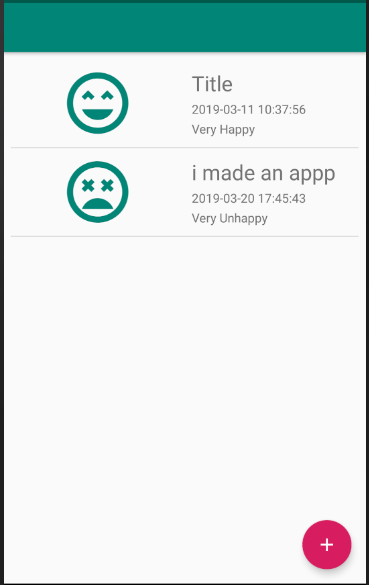
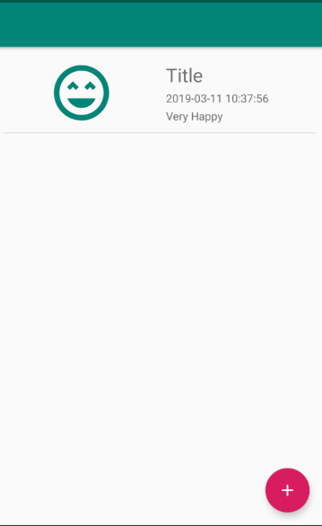
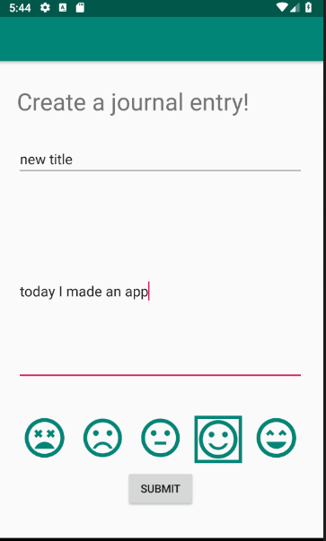
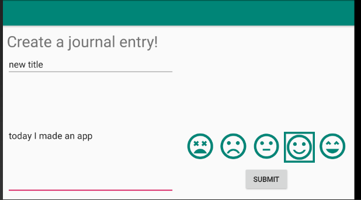
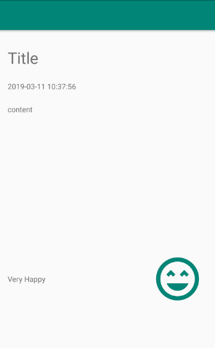

# NAS19-Journal

This app allows the user to create a journal and fill it with entries. Each entry can be given a title, content and a mood, associated with a picture ranging from 'very unhappy' to 'very happy'.

## Main activity screen

## Long pressing an entry deletes it from the database

## Portrait and landscape mode, memory management example

The selected mood is preserverd throughout rotation.

## Example of a journal entry detail

